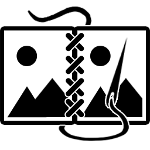

# Image-to-PDF-stitcher

This small python program allows users to open a selection of saved images and then concat them as pages to create a PDF-file.

## Usage 
Upon launching the application, users can import images for PDF-conversion by clicking one of the `load`-buttons. They have the option to either select a folder containing images or pick individual files.
Once the images are loaded into the interface, they will appear in the preview section. Depending on the quantity and size of the images, this process may take a moment.

The program provides various options for customizing the layout of the resulting PDF.
Users can choose between different preset sorting orders for the images, namely the file's name, create date or when it was last modified.
Additionally, by adjusting the left, right, top and bottom margins the images can be cropped and unneccessary or undesired borders or image sections, such as task bars in screenshots,  can be excluded, either for each individual file or for all at once.
Another option is the eventual layout of the PDF. Through clicking one of the layout icons the user can switch between giving each image its own page or by combining two neighboring ones into a double-page. To accommodate different language conventions, double-pages offer two different reading directions: left-to-right or right-to-left.
Furthermore, for double-page layouts, there's an option to designate the first image as a standalone cover for added customization.

Once all adjustments are made, the user can click the `create PDF`-button, which opens a separate save dialog. 
Here, they can specify the save path for the resulting PDF and choose from several quality options to minimize the needed memory space, including compression level, DPI resolution, image scaling, grayscale conversion and file size optimization.
